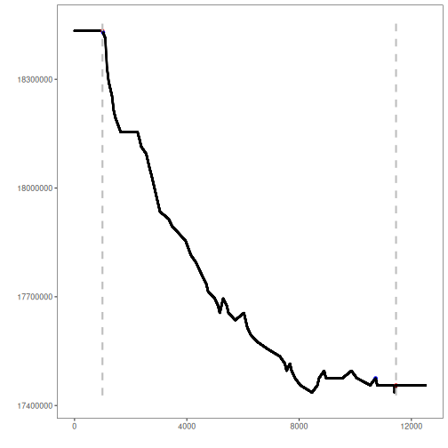

Overview

The 3W dataset contains the first realistic and public collection of rare,
undesirable real events in oil well drilling. This notebook demonstrates change
point detection (CPD) on a univariate sensor extracted from a multivariate well
series.

Dataset notes
- Multivariate series with labeled change points (CPs)
- Recommended use: multivariate or univariate CPD detection
- Source: https://archive.ics.uci.edu/ml/datasets/3W+dataset


## Load packages and dataset
Load the required packages for data access, modeling, visualization, and evaluation.

``` r
library(united)
library(daltoolbox)
library(harbinger)
```

Select a well as example and extract a series.


``` r
## Load series ----------------------
data(oil_3w_Type_1)
```


``` r
# Select first well from the Type 1 group
data <- oil_3w_Type_1[[1]]
```


## Univariate series selection
Select the desired variable directly from preprocessed data.


``` r
# Choose a sensor (e.g., P_TPT) and plot
series <- data$p_tpt
plot(as.ts(series))
```


## Event detection experiment
Define a CPD method and generate detections.

``` r
# Establish binary segmentation CPD model
model <- hcp_binseg()
```


``` r
# Fit the CPD model
model <- fit(model, series)
```


``` r
# Produce change-point detections
detection <- detect(model, series)
```

```
## Warning in BINSEG(sumstat, pen = pen.value, cost_func = costfunc, minseglen = minseglen, : The number of changepoints
## identified is Q, it is advised to increase Q to make sure changepoints have not been missed.
```


## Results analysis
Inspect detected CPs, visualize overlays, and compute metrics.

``` r
# Show detected change points
print(detection |> dplyr::filter(event == TRUE))
```

```
##     idx event        type
## 1   994  TRUE changepoint
## 2 11453  TRUE changepoint
```

Visual analysis

``` r
# Plot detections (blue) vs. labels (red bands)
grf <- har_plot(model, series, detection, data$event)
plot(grf)
```



Evaluate metrics

``` r
# Point-wise evaluation (no tolerance)
ev <- evaluate(model, detection$event, data$event)
print(ev$confMatrix)
```

```
##           event      
## detection TRUE  FALSE
## TRUE      0     2    
## FALSE     2     12501
```


``` r
ev$accuracy
```

```
## [1] 0.9996801
```

``` r
ev$F1
```

```
## [1] NaN
```

### SoftEd Evaluation
To analyze the results considering temporal tolerance, softED smoothed metrics can be used, as performed below.


``` r
ev_soft <- evaluate(har_eval_soft(sw = 90), detection$event, data$event)
print(ev_soft$confMatrix)
```

```
##           event         
## detection TRUE  FALSE   
## TRUE      0.74  1.26    
## FALSE     1.26  12501.74
```


``` r
ev_soft$accuracy
```

```
## [1] 0.9997992
```

``` r
ev_soft$F1
```

```
## [1] 0.3722222
```

## References
- Truong, C., Oudre, L., & Vayatis, N. (2020). Selective review of change point detection methods. Signal Processing, 167, 107299.
